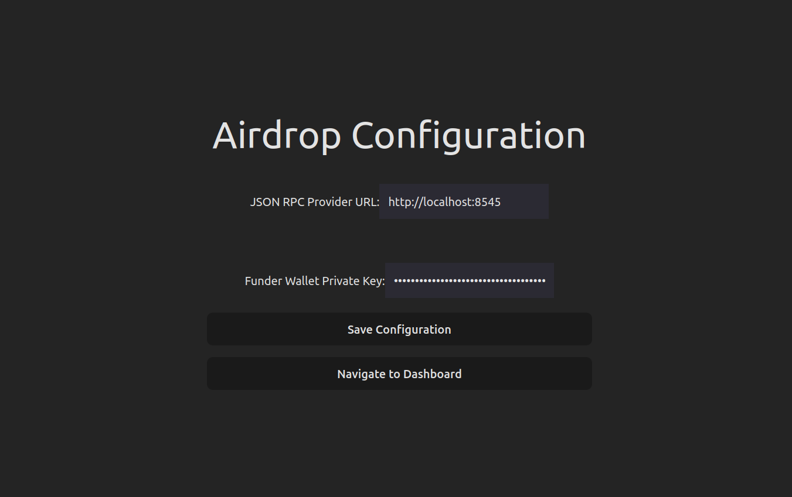
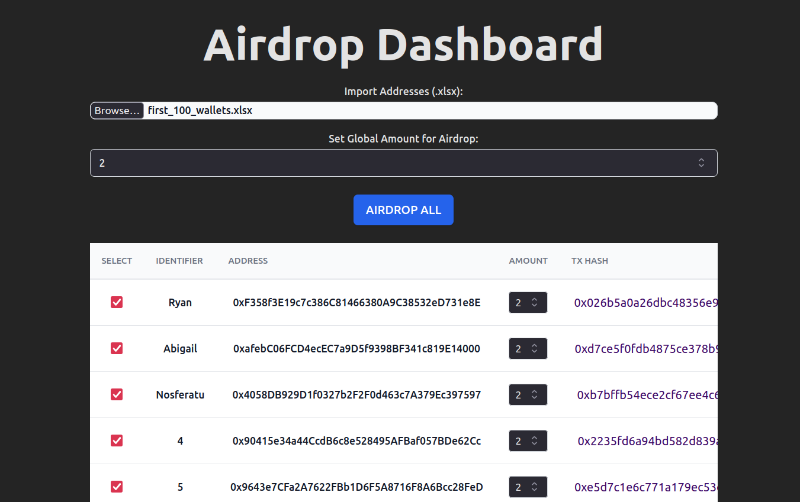

# What is it?

Airdrop dashboard is a GUI app for airdroping any kind of tokens, native gas tokens (ETH, MATIC, VANRY) , ERC-20 , NFTs to a list of addresses imported directly from Excel. The UI allows you to select, deselect, manually change the amt for particular addresse, set a global airdrop amt etc

# How to use

- On the config page, set the Json RPC url and the funder's wallet address

- Click on the browse btn to select an excel sheet for data, where the first col must contain names / IDs, second must contain wallet addr  
  

- Deselect some addr and change amounts as per choice

- Click on Airdrop All to airdrop the respective amts

- View the tx Hashes on the explorer from confirmation
